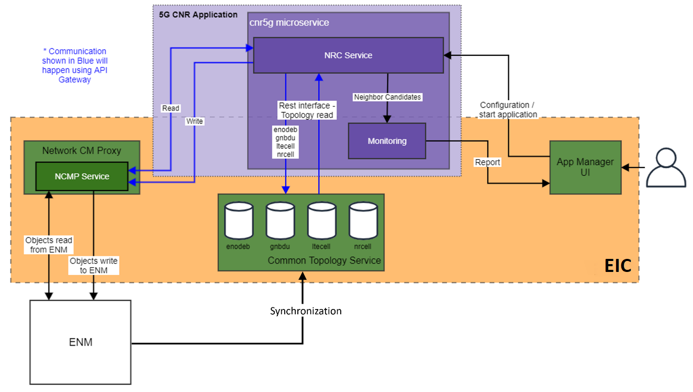

<!--Document information:
Prepared:Mansour Abu Siam
Approved:***
Document Name:5G CNR User Guide
Revision: {!../../.bob/var.version!}
Date: {!../../.bob/var.date!}
-->

# 5G CNR User Guide

## Overview

This document provides an overview of the 5G CNR Service. It gives a
brief description of its main features and its interfaces.

5G Centralized Neighbor Relations (5G CNR) rApp is a microservices that supports LTE to 5G FR2 cell relationship creation. It provides the information needed by the LTE nodes for ANR on the node to work with 5G FR2 cells.

- 5G CNR consumes the cell geo and topological data, evaluating which cells are neighboring each other, and configuring this neighbor information on the cells of Gnbdu.
- Create new MOs in ENM for the neighbor candidates.
- Configures any missing X2 Links on the ENodeB towards these GNobeB
- 5G CNR has two main dependencies, Common Topology Service (CTS) and Network CM-Proxy (NCMP) that is used to communicate with Ericsson Network Manager (ENM).

There are three different parameters that the user can set for the ANR algorithm these are:

- A list of eNodeBs (Mandatory) - This will limit the LTE Nodes considered in the neighbor search (possible use case, only consider these LTE Nodes in each area)
- Distance (Optional)- This will be the distance in meters used for the neighbor search geo query in CTS.
- Frequency Pairs (Optional)- The user can define 4G and 5G frequency pairs for filtering the neighbor relations.

### Supported Use Cases

This chapter gives an overview of the supported use cases.

| Use Case ID          | Use Case Title                                                    | Compliance                       | Maturity |
|----------------------|-------------------------------------------------------------------|----------------------------------|----------|
| UCI.5GCNR.ENODEBS    | Find potential neighbors for given eNodeB IDs                     | Fully Supported up to 500 eNodeB | Alpha    |
| UCI.5GCNR.DISTANCE   | Find potential neighbors for different distances                  | Fully Supported                  | Alpha    |
| UCI.5GCNR.FREQPAIRS  | Filter potential neighbors based on frequency pairs               | Fully Supported                  | Alpha    |
| UCI.5GCNR.ENM        | Create missing objects in ENM to setup neighbor relations in NCMP | Fully Supported                  | Alpha    |
| UCI.5GCNR.MONITORING | The user is able to check the scheduled NRC processes             | Fully Supported                  | Alpha    |

### Architecture

5G CNR has mandatory dependencies, CTS and NCMP services. CTS stores the topology information (nodes, cells) and provides the Geo Query functionality.
While the NCMP is working as a proxy between 5G CNR and ENM.
The following picture shows the 5G CNR Service and its
architectural context.



Figure 1 Architecture view of 5G CNR

| Interface Logical Name | Interface Realization                                                                                                                          | Description                           | Interface Maturity |
|------------------------|------------------------------------------------------------------------------------------------------------------------------------------------|---------------------------------------|--------------------|
| /startNrc              | [API documentation - NRC methods](https://adp.ericsson.se/marketplace/5g-cnr-assist/documentation/development/dpi/api-documentation#__methods) | Start neighbour relation calculation. | Alpha              |
| /monitoring            | [API documentation - NRC methods](https://adp.ericsson.se/marketplace/5g-cnr-assist/documentation/development/dpi/api-documentation#__methods) | Query NRC task details.               | Alpha              |
| /monitoring/{id}       | [API documentation - NRC methods](https://adp.ericsson.se/marketplace/5g-cnr-assist/documentation/development/dpi/api-documentation#__methods) | Query NRC task details using UUID.    | Alpha              |

### Deployment View

The Ericsson 5G Centralized Neighbor Relations rApp (5G CNR) is packaged as a Docker container. It supports deployment in Kubernetes using Helm.

The 5G CNR Service depends on the Common Topology Service (CTS) and the Network Configuration Management Proxy service (NCMP).


Figure 2 Deployment view of 5G CNR

To deploy the Service, refer to the [Deployment section](#deployment), which:

- explains how to get started using the 5G CNR Service in the
supported environments.
- specifies configuration options for starting the 5G CNR docker
container.

If problems occur when using the service, refer to the [Troubleshooting section](#troubleshooting).

### Dimensioning and Characteristics

#### Dimensioning

To handle dimensioning configuration at deployment time,
refer to the [Deployment section](#deployment).

#### Scaling

Autoscaling for the service can be enabled in helm chart values.yml.

| Scaling Supported (Yes/No) | Minimum number of instances | Maximum number of recommended instances |
|----------------------------|-----------------------------|-----------------------------------------|
| Yes                        | 1                           | 100                                     |

#### Resilience

5G CNR Service uses Liveness and Readiness probes provided by Kubernetes.

## Deployment

This section describes the operational procedures for how to deploy and upgrade
the 5G CNR Service in a Kubernetes environment with Helm. It also
covers hardening guidelines to consider when deploying this service.

### Prerequisites

- A running Kubernetes environment with helm support, some knowledge
    of the Kubernetes environment, including the networking details, and
    access rights to deploy and manage workloads.

- Access rights to deploy and manage workloads.

- Availability of the kubectl CLI tool with correct authentication
    details. Contact the Kubernetes System Admin if necessary.

- Availability of the Helm package.

- Availability of Helm charts and Docker images for the service and
    all dependent services.

- ENM should be filled up with valid live network data, and it should be synchronized with CTS

### Custom Resource Definition (CRD) Deployment

The 5G CNR Service does not publish any CRD.

### Deployment in a Kubernetes Environment Using Helm

This section describes how to deploy the service in Kubernetes using Helm and
the `kubectl` CLI client. Helm is a package manager for Kubernetes that
streamlines the installation and management of Kubernetes applications.

#### Preparation

Prepare helm chart and docker images.

#### Pre-Deployment Checks for 5G CNR

Ensure the following:

- The eric-oss-5gcnr is not used already in the corresponding cluster.
Use `helm list` command to list the existing deployments (and delete previous
deployment with the corresponding eric-oss-5gcnr if needed).

- The same namespace is used for all deployments.

- Add CRD Dependencies.

#### Helm Chart Installations of Dependent Services

The 5G CNR Service runs on the EIC platform. It depends on the NCMP and the Common Topology Services and communicating through the API Gateway.

For instructions on how to install dependencies see:

[Keycloak client](https://www.keycloak.org/docs/11.0/getting_started/)

[API Gateway](https://adp.ericsson.se/marketplace/api-gateway9)

[NCMP - User Guide](https://cpistore.internal.ericsson.com/elex?LI=EN/LZN7030336/1R**&FN=75_1543-CSH109779_1Uen.*.html)

[Common Topology Service - User Guide](https://cpistore.internal.ericsson.com/elex?LI=EN/LZN7030336/1R**&FN=75_1543-CSH109779_1Uen.*.html)

#### App Manager Installation of 5G CNR Service

For installing the application using the onboarding and instantiation functionalities of the app manager, see the developer guide sections of the app manager:

[Onboard an App from a CSAR App Package File](https://adp.ericsson.se/marketplace/app-onboarding/documentation/1.0.79/dpi/application-developers-guide#onboard-an-app-from-a-csar-app-package-file)

[Instantiate an instance of an app](https://adp.ericsson.se/marketplace/app-lcm/documentation/1.0.112/dpi/application-developers-guide#instantiate-an-instance-of-an-app)


#### Helm Chart Installation of 5G CNR Service

>**_Note:_** Ensure all dependent services are deployed and healthy before you
>continue with this step (see previous chapter).

Helm is a tool that streamlines installing and managing Kubernetes
applications. 5G CNR can be deployed on Kubernetes using
Helm Charts. Charts are packages of pre-configured Kubernetes resources.

Users can override the default values provided in the values.yaml template of
the helm chart. The recommended parameters to override are listed in the
following section: [Configuration Parameters](#configuration-parameters).

##### Deploy the 5G CNR Service

Install the 5G CNR on the Kubernetes cluster by using the
helm installation command:

```text
helm install <CHART_REFERENCE> --name <RELEASE_NAME> --namespace <NAMESPACE> [--set <other_parameters>]
```

The variables specified in the command are as follows:

- `<CHART_REFERENCE>`: A path to a packaged chart, a path to an unpacked chart
directory or a URL.

- `<RELEASE_NAME>`: String value, a name to identify and manage your helm chart.

- `<NAMESPACE>`: String value, a name to be used dedicated by the user for
deploying own helm charts.

##### Verify the 5G CNR Service Availability

To verify whether the deployment is successful, do as follows:

1.  Check if the chart is installed with the provided release name and
    in related namespace by using the following command:

```text
helm ls <namespace>
```

  Chart status should be reported as "DEPLOYED".

2.  Verify the status of the deployed helm chart.

```text
helm status <release_name>
```

  Chart status should be reported as "DEPLOYED". All Pods status should be
  reported as "Running" and number of Deployment Available should be the
  same as the replica count.

3.  Verify that the pods are running
    by getting the status for your pods.

```text
kubectl get pods --namespace=<namespace> -L role
```

  For example:

```text
helm ls example
helm status examplerelease
kubectl get pods --namespace=example -L role
```

  All pods status should be "Running". All containers in any pod should
  be reported as "Ready". There is one POD marked as the master role and
  the other PODs are marked as the replica role.

### Configuration Parameters

#### Mandatory Configuration Parameters

The parameters in following table are mandatory to set at deployment time.
If not provided, the deployment will fail. There are no default values
provided for this type of parameters.

| Variable Name                                    | Description                                                                                                                                           |
|--------------------------------------------------|-------------------------------------------------------------------------------------------------------------------------------------------------------|
| global.hosts.iam                                 | This is the EIAP platform IAM ingress fully qualified host name. Ingress values could be queried with 'kubectl get ingresses -A' command              |
| global.hosts.pf                                  | This is the EIAP platform Policy Framework manager ingress fully qualified host name. Values could be queried with 'kubectl get ingresses -A' command |
| namespace                                        | Namespace name where the rApp has to be installed (currently the same with the EIAP namespace)                                                        |
| integration.policyFramework.credentials.login    | Provide the user name that will be used to access CNR REST endpoint. It should be created as part of the installation.                                |
| integration.policyFramework.credentials.password | Provide the password for it. It should be created as part of the installation.                                                                        |
| integration.policyFramework.enabled              | true                                                                                                                                                  |
| integration.policyFramework.hooks.enabled        | true                                                                                                                                                  |


#### Optional Configuration Parameters

The service doesn't have any optional configuration parameters.

### Service Dimensioning

The service provides by default resource request values and resource limit
values as part of the Helm chart. These values correspond to a default size for
deployment of an instance. This chapter gives guidance in how to do service
dimensioning and how to change the default values when needed.

#### Override Default Dimensioning Configuration

If other values than the default resource request and default resource limit
values are preferred, they must be overridden at deployment time.

Here is an example of the `helm install` command where resource requests and
resource limits are set:

```text
helm install <*ADD link to tar file package*> --name eric-data-myservice --namespace test-deployment-namespace --set <*ADD request and limit parameters valid for this service*>
```

#### Use Minimum Configuration per Service Instance

This chapter specifies the minimum recommended configuration per service
instance. <*Columns not applicable in table below should be removed*>

| Resource Type (Kubernetes Service) | Resource Request Memory | Resource Limit Memory | Resource Request CPU | Resource Limit CPU | Resource Request Disk | Resource Limit Disk |
|------------------------------------|-------------------------|-----------------------|----------------------|--------------------|-----------------------|---------------------|
| eric-oss-cnr5gassist               | 512Mi                   | 2Gi                   | 250m                 | 1                  | -                     | -                   |
| keycloak-client                    | 64Mi                    | 256mi                 | 50m                  | 100m               | -                     | -                   |
| eric-api-gateway-client            | 256Mi                   | 512Mi                 | 250m                 | 500m               | -                     | -                   |

To use minimum configuration, override the default values for resource requests
and resource limits in the helm chart at deployment time.

#### Use Maximum (Default) Configuration per Service Instance

The maximum recommended configuration per instance is provided as default in the
Helm chart. Both Resource Request values and Resource Limit values are included
in the helm charts.

### Hardening

The service is by default pre-hardened. No additional hardening is required.
The following pre-hardening actions have been made:

- The service is built on a minimalistic container image with small footprint. Only the required libraries are included.
- The container goes through vulnerability scanning.
- The service is configured to the strict minimum of services and ports to minimize the attack surface.
- The service is not exposed outside of the cluster by default.
- The Service utilizes a container optimized operating system (Common Base OS) and latest security patches are applied.

### Upgrade Procedures using App Manager

For upgrading the application using the onboarding and instantiation functionalities of the  app manager, see the developer guide sections of the app manager:

[Update an Onboarded app](https://arm1s11-eiffel004.eiffel.gic.ericsson.se:8443/nexus/content/sites/tor/idun-sdk/latest/services/app-onboarding/developer-guide.html#update-app)

[Update an instance of an app](https://adp.ericsson.se/marketplace/app-lcm/documentation/1.0.112/dpi/application-developers-guide#update-an-instance-of-an-app)


### Upgrade Procedures using Helm

>**_Note:_** If any chart value is customized at upgrade time through the
>"--set" option of the "helm upgrade" command, all other previously customized
>values will be replaced with the ones included in the new version of the chart.
>To make sure that any customized values are carried forward as part of the
>upgrade, consider keeping a versioned list of such values. That list could be
>provided as input to the upgrade command in order to be able to use the "--set"
>option without side effects.

To upgrade the 5G CNR Service after a new version becomes available, run the helm upgrade command using the following syntax:

```text
helm upgrade <RELEASE> <CHART_REFERENCE>
```
If the cluster is under a heavy load, increase the readiness probe initial delay to 60 seconds:

```text
helm upgrade <RELEASE> <CHART_REFERENCE> --set readynessProbeInitialDelaySeconds=60
```
To rollback The 5G CNR Service to a previous version, run the helm upgrade command using the following syntax:

```text
helm rollback <RELEASE> <REVISION>
```

## Security Guidelines

### Operative Tasks

This service does not include any operative tasks.

### External Ports

The following ports are exposed to the outside of the cluster:

| Service or Interface name | Protocol | IP Address Type | Port | Transport Protocol | IP Version    |
|---------------------------|----------|-----------------|------|--------------------|---------------|
| REST service port         | HTTP	    | OAM IP          | 8080 | TCP                | IPv4 and IPv6 |

### Internal Ports

The following ports are cluster internal ports and not exposed to the outside:

| Service or Interface name            | Protocol    | IP Address Type | Port | Transport Protocol | IP Version     |
|--------------------------------------|-------------|-----------------|------|--------------------|----------------|
| Start NRC REST API                   | 	HTTP/HTTPS |                 |      | TCP                | 	IPv4 and IPv6 |
| Monitoring REST API                  | 	HTTP/HTTPS |                 |      | TCP                | 	IPv4 and IPv6 |
| Probes REST API (Used by Kubernetes) | 	HTTP       | 	OAM IP         |      | TCP                | 	IPv4 and IPv6 |
| Metrics REST API (Used by PM Server) | 	HTTP       | 	OAM IP         |      | TCP                | 	IPv4 and IPv6 |

### Certificates

No certificates are used.

### Security Events that can be logged

No security events logged by the service.

## Privacy User Guidelines

The 5G CNR service does not collect, store or process personal data.

## Operation and Maintenance

<*In addition to the sections regarding the Core FA's operations reported below,
include here the subsections to describe any relevant service specific
operation*>

### Performance Management

5G CNR Service generates metric information which can be retrieved by the PM Server in order to analyze the http(s) traffic.

#### Default Metrics

The PM Metrics provided by the 5G CNR are listed in the 5GCNR_pm_metrics.json file:

<*Add a link to the &lt;SERVICE_NAME&gt;_pm_metrics.json file location in the*
*Marketplace documentation artifactory repository*>

<*Instructions: Replace the &lt;SERVICE_NAME&gt; with the name of the service*
*used in the helm chart, for example "eric-ref-catfacts-text-analyzer".*
*The &lt;SERVICE_NAME&gt;_pm_metrics.json file is created following*
*the procedure on*
*[PM Metrics Fragment handling](https://confluence.lmera.ericsson.se/display/ACD/PM+Metrics+Fragment+handling)*
*and the json file is uploaded to*
*Marketplace documentation artifactory repository.*>

#### KPIs

The service does not have any kind KPIs.

### Backup and Restore

The service does not support any kind of backup and restore operation.

### Scaling

Scaling is supported. Please see sections Resilience, Metrics and Scaling for more information.

## Troubleshooting

This section describes the troubleshooting functions and procedures for
the 5G CNR. It provides the
following information:

-   Simple verification and possible recovery.

-   The required information when reporting a bug or writing a support case,
    including all files and system logs that are needed.

-   How to retrieve the above information from the system.

### Prerequisites

-   `kubectl` CLI tool properly configured

### Installation

If the installation of the 5G CNR Service fails, the logs need be collected, refer to the Data Collection chapter.

Failed installation can be deleted with following command:

```text
helm delete <release_name>
```

After analyzing and correcting the problems indicated by the collected logs, the Identity and Access Management Service can be installed again, refer to the Deploy the Identity and Access Management Service.

### Deletion of Release

If the deletion of the release of the 5G CNR Service fails, the logs can be collected, refer to the Data Collection chapter.

If the deletion of the release doesn't work as specified in Installation chapter, following command can be used:

```text
helm delete --purge --no-hooks <release_name>
```

### Health checks

Use the procedures in Verify the 5G CNR Service Availability chapter to verify the healthiness of the service and to verify that it is working as expected.

### Enable debug logging

Only enable debug logging in order to troubleshoot a problem that can be reproduced. Debug logging may impact performance.

### Log Categories

Log Categories are used to support automatic filtering which enable a
possibility to support AI and machine learning. In the table below the log
categories provided by the service are listed.

| Category Name | Security Log | Description                                                                                                    |
|---------------|--------------|----------------------------------------------------------------------------------------------------------------|
| INFO          | no           | Use this level priority for service life-cycle events and other crucial related information                    |
| WARN          | no           | Use the WARN level priority for events that may indicate a non-critical service error                          |
| ERROR         | no           | Use this level priority for events that indicate a disruption in a request or the ability to service a request |
| DEBUG         | no           | Only used for debugging purposes, never on production environments                                             |
| ALL           | no           | Turns logging on for all levels                                                                                |
| OFF           | no           | Turns logging off                                                                                              |

### Data Collection

- The logs are collected from each pod using command:

```text
kubectl exec <pod name> --namespace=<pod's namespace> \
collect_logs > <log file name>.tgz
```

- The detailed information about the pod are collected using command:

```text
kubectl describe pod <pod name> --namespace=<pod's namespace>
kubectl exec <pod-name> --namespace=<pod's namespace> env
```

### Recovery Procedure

This section describes how to recover the service in case of malfunction.

#### Restarting the pod

The 5G CNR Kubernetes pod can be restarted as a recovery action:

```text
kubectl get pod <pod> --namespace=<namespace> -o yaml | kubectl replace --force -f -
```

#### Data Recovery

Data recovery is not possible at this moment. 5G CNR does not persist any data yet, planned to persist on CPS when available.

### Alarm Handling

Not applicable.

### Known Issues

None.